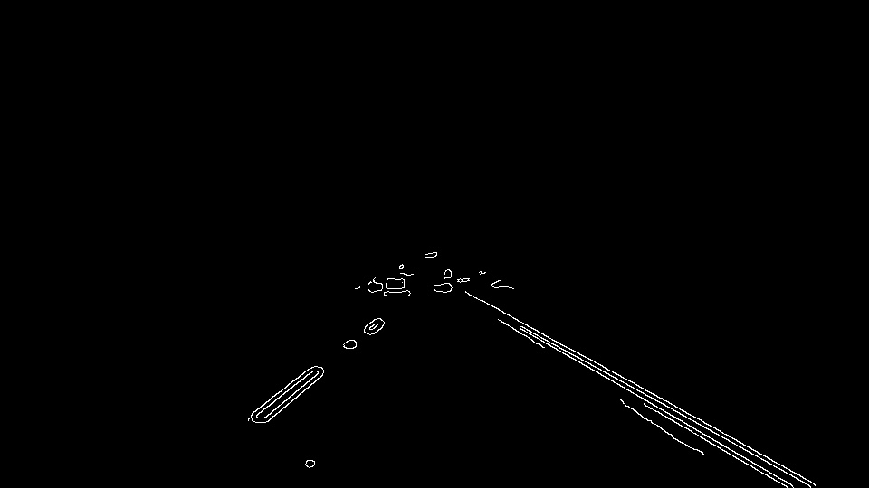
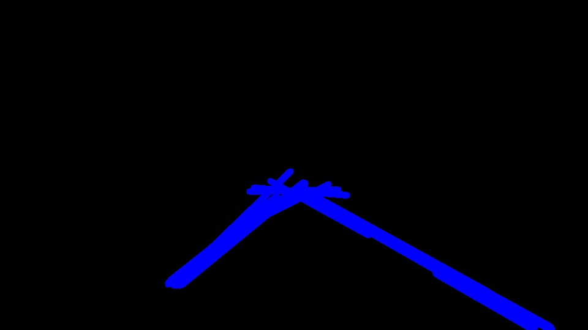
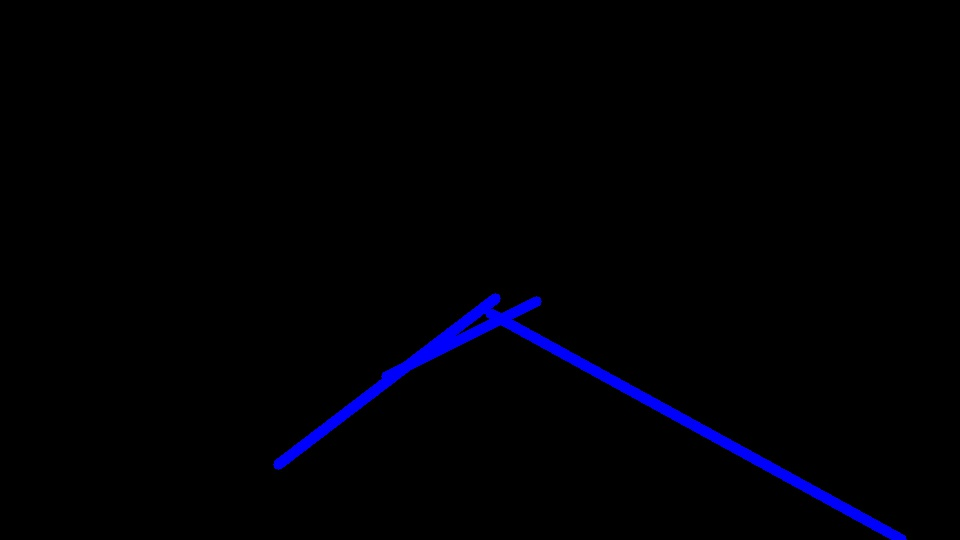
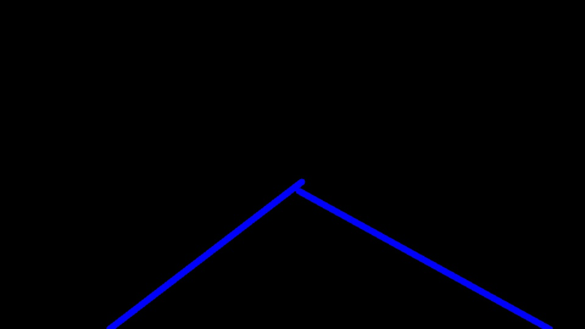
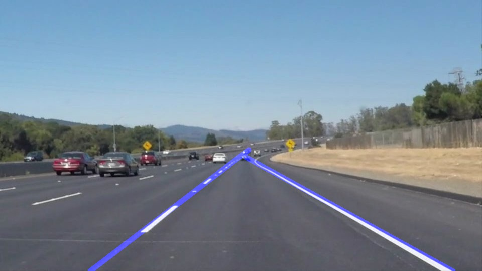

#**Finding Lane Lines on the Road** 

The goals / steps of this project are the following:
* Make a pipeline that finds lane lines on the road
* Reflect on your work in a written report

[//]: # (Image References)

[image1]: ./examples/grayscale.jpg "Grayscale"

---

## Reflection

###1. Pipeline

Let the solidWhiteCurve image as example. I'll demonstrate how my pipeline work.

The input image is this:

#### (1)Edge Detection

I use Canny Edge Detection algorithm to detect the edges.

First off, I use Gaussian Blur(kernel size = 13) to smooth the image and then make it gray by using the helper function gaussion_blur and gayscale.

Second, I use cv2.equalizeHist to make the histogram of the grayscale image equalized. This step can avoid the image being too bright or too dark or too gray to be edge detected.

Last, I use the help function canny to detect edges(low_threshold = 70, high_threshold=150) and return the triangular region of interest.

After this step, we can get the edge image as follow:

#### (2)Finding Candidate Lines

1. Hough Transform(rho=1, theta=0.017, threshold=10, min line len=140, max line gap=100). The value of max line gap is large, because this value can connect the incontinuous lines on one side of the lane. Plot the lines you can see the following image:

2. Removing horizontal lines. The lines that are horizontal are not what we want because the lane we currently drive in can not be horizontal. So I remove all of them.
3. Merge similar lines. Some of the lines are very similar to each other, which means they have similar slope and one's start point is on another's line.
4. Connect segment lines that are nearly on the same strait line. If the distance of one's start point to the strait line, which another segment line is on, smaller than a threshold(I set it as 20) then I connect these two segment line.

After this step, plot the lines you can see:

#### (3)Filtering Lines

1. Sort the candidate lines by their length, from short to long.
2. Remove the shorter lines that conflict with longer one. The conflict means two lines have the similar theta, which is the angle between the line and the horizon. 
3. Lengthen the line to make it reach the bottom of the image.

After this step, plot the lines you can see:

#### (4)Smoothing Lines

This step can only work when processing the video.

I use a pre_state list to store the values of the coordinate of two lines' start point and end point. Each time I append the new coordinates to the pre_state list, and then let the mean value of last 8 elements in that list be the new lines' coordinates.

However, there are some special cases:

1. The number of lines that we detected is more than or less than 2. If there are too many lines, we can just take out 2 longest lines. If there is only one line or we detected nothing, then we just use the mean value as new lines and append nothing to the pre_state list.
2. The lines' coordinate change a lot. If there is an abrupt change on the lines' coordinate value, we can judge it as abnormal case. Because in an series of video stream, the change on the lane is sooth rather than dramatic. So we use the mean lines as new lines and append nothing to the pre_state list.

#### (5)Draw

Finally we draw the image by the lines we dectected.

###2. Potential shortcomings

One potential shortcoming would be it can not detect the lane when the car is perpendicular to the lane or the lane is out of the region of interest I defined.

Another shortcoming could be this algorithm can not regocnize all the lane lines on the road, and it can't distinguish between the lane lines and a row of people dressed in white.

Third the algorithm is not robust enough to detect the lane when the lane lines figure is fuzzy. The only thing it can do when the detection is not convincing is to predict the lane lines based on the previous lane lines data.

Last the algorithm is not fast.

###3. Suggest possible improvements to your pipeline

A possible improvement would be to change lane lines predict algorithm. When the one of the lane line detection result is not convincing, we can also use the other lane line to predict this one's change.

Another potential improvement could be to reconstruct the algorithm to optimize the speed.